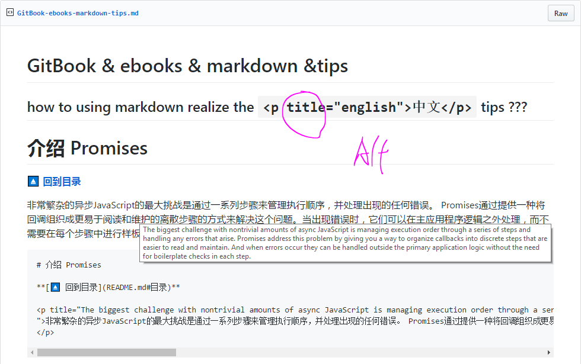

# GitBook

gitbook

G:\wwwRoot\learning\GitHub & Git\GitBook

G:\wwwRoot\javascript\ES6-Tutorials

## JavaScript with Promises

https://www.gitbook.com/@xgqfrms-github/settings/github

https://github.com/integrations/gitbook/installations/new/permissions?target_id=18028768

https://xgqfrms-github.gitbooks.io/javascript-with-promises/content/

https://www.gitbook.com/book/xgqfrms-github/javascript-with-promises/details

# Summary

* [Summary](SUMMARY.md)

* [目录](README.md)
* [序言](chapter-00-preface.md)
* [Chapter 01 - 异步 JavaScript](chapter-01-asynchronous-javascript.md)
* [Chapter 02 - 介绍 Promises](chapter-02-introducing-promises.md)
* [Chapter 03 - 使用标准 Promises](chapter-03-working-with-standard-promises.md)
* [Chapter 04 - 使用库和框架](chapter-04-using-libraries-and-frameworks.md)
* [Chapter 05 - 错误处理](chapter-05-error-handling.md)
* [Chapter 06 - 将 ECMAScript6的特性与 Promises相结合](chapter-06-combining-ecmascript-6-features-with-promises.md)
* [索引](chapter-07-index.md)
* [关于作者](chapter-08-about-the-author.md)

https://gist.github.com/xgqfrms-GitHub/11a118ace954e40e3d2530c60cad2d95

React Cookbook

**[⬆️ 回到目录](#目录)**

**[⏏️ 回到目录](#目录)**

💻

🏠

🏡

⬆️

©️ Copyright
®️ Registered

🖇️ Linked Paperclips

🔗 Link

⚓ Anchor

**[🖇️ 回到目录](SUMMARY.md)**

**[🔗 回到目录](SUMMARY.md)**

**[⚓ 回到目录](SUMMARY.md)**

SUMMARY.md#目录

*
*[🖇️ 回到目录](README.md)**
**[🔗 回到目录](README.md)**
**[⚓ 回到目录](README.md)**

**[⬆️ 回到目录](README.md#目录)**
**[⏏️ 回到目录](README.md#目录)**

both OK, the [default page](https://xgqfrms-github.gitbooks.io/javascript-with-promises/content/) is the readme.md

=> https://xgqfrms-github.gitbooks.io/javascript-with-promises/content/index.html

https://xgqfrms-github.gitbooks.io/javascript-with-promises/content/chapter-02-introducing-promises.html

https://xgqfrms-github.gitbooks.io/javascript-with-promises/content/chapter-03-working-with-standard-promises.html

## how to using markdown realize the `
中文
` tips ???

https://gist.github.com/xgqfrms-GitHub/cc5f28ba7d1353f6852f9aaef2f2e204

markdown-tips.png

**⏏️[回到目录](README.md#目录)**

**[⏏️ 回到目录](README.md#目录)**

https://webpack.toobug.net/zh-cn/

https://github.com/TooBug/javascript.patterns/

https://jayli.github.io/

https://git-scm.com/blog/2010/03/02/undoing-merges.html

https://www.toobug.net/article/git_revert_merge.html

https://www.toobug.net/article/learning_es6_generator.html

https://www.toobug.net/article/array_unique_in_javascript.html

https://www.gitbook.com/book/xgqfrms-github/javascript-with-promises/settings

## GitBook markdown-title-test-OK

https://xgqfrms-github.gitbooks.io/javascript-with-promises/content/chapter-02-introducing-promises.html

